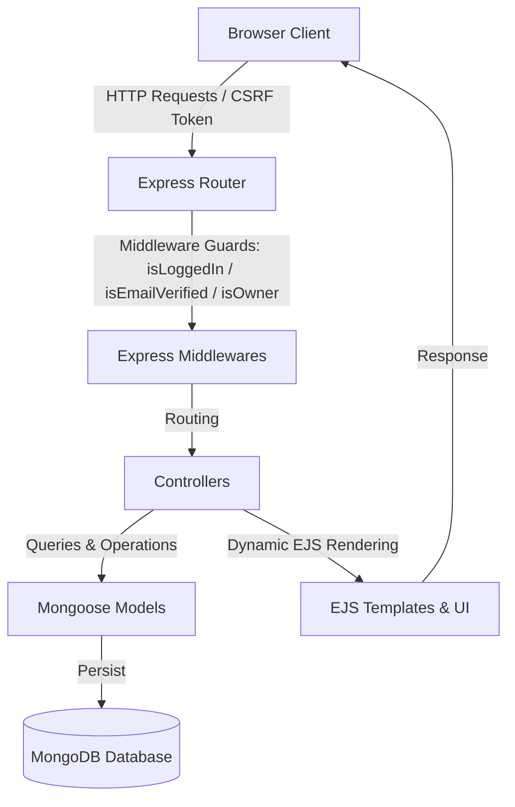

# Wanderlust ✈️

A premium, production-grade, full-stack travel and accommodation marketplace modeled after Airbnb. Wanderlust is built using the **MVC (Model-View-Controller)** design pattern, featuring robust user security pipelines, interactive review systems, secure cloud-based media uploads, dynamic wishlists, and a beautiful UI/UX.

---

## 🌟 Key Features

### 🔒 Industry-Grade Security & Authentication
- **Passport.js Engine**: Seamless registration, local-strategy login, and session persistence using `passport` and `passport-local-mongoose`.
- **Double-Layer Email Verification**: Real-time sign-up verification utilizing **Nodemailer** to send unique expiration-guarded tokens, unlocking listings and reviews only for verified wanderers.
- **CSRF Protection**: Comprehensive Cross-Site Request Forgery (`csurf` middleware) protection across all POST/PATCH/DELETE endpoints.
- **Production Session Storage**: High-performance, production-grade session persistence in MongoDB using `connect-mongo` instead of volatile in-memory sessions.

### 🏠 Property & Marketplace Engine (CRUD)
- **Advanced Listings**: Create, browse, edit, and delete highly detailed property listings with categorization (Rooms, Mountains, Pools, Farms, etc.).
- **Interactive Map & Geocoding**: Integrated geocoding to display property locations on an interactive map.
- **Dynamic Wishlist System**: Authenticated users can curate, save, and manage their favorite listings into a personalized wishlist.

### ☁️ Media & Performance
- **Cloud Media Hosting**: Integrated with **Cloudinary API** via `multer` for direct image uploads.
- **Automated Compression**: Features automatic image resizing and transformation (`/w_250`) for superfast card loading and low bandwidth usage.

### 💬 Interactive Social Features
- **Review & Rating Engine**: Sleek 5-star rating system with strict owner/author guardrails (only authenticated guests can review, and authors can delete their reviews).
- **Custom User Profiles**: Dedicated profile dashboards displaying user status (verified/unverified), custom preset avatars, and quick access to listing management.

### 📐 Robust Architecture & Code Quality
- **RESTful Endpoints**: Predictable, clean API mapping.
- **Validation Schemas**: Client & Server-side validation powered by **Joi** schemas.
- **Centralized Error Handling**: Unified asynchronous error handler (`wrapAsync`) paired with customized `ExpressError` middleware.
- **Husky & Lint-Staged Pipeline**: Automated pre-commit checks strictly enforcing **ESLint** code formatting rules and Conventional Commit standards.

---

## 🛠️ Tech Stack

- **Frontend**: HTML5, Vanilla CSS3 (glassmorphism elements, micro-animations), EJS (Embedded JavaScript Templates), Bootstrap 5, FontAwesome Icons.
- **Backend**: Node.js, Express.js (REST APIs, Router).
- **Database**: MongoDB (NoSQL), Mongoose ODM.
- **Authentication & Security**: Passport.js, Nodemailer (Email Verification), Csurf (CSRF Protection).
- **Media Hosting**: Cloudinary Storage Cloud API.
- **Production Persistence**: Express-Session & Connect-Mongo (MongoDB Session Store).
- **Quality Assurance**: ESLint, Prettier, Husky Pre-commit hooks, Commitlint.

---

## 📐 Architecture Overview (MVC)



---

## 🚀 Getting Started

### Prerequisites
Make sure you have [Node.js](https://nodejs.org/) (v20+) and [MongoDB](https://www.mongodb.com/) installed and running locally.

### Installation & Setup

1. **Clone the Repository**:
   ```bash
   git clone https://github.com/charmyparmar/wanderlust.git
   cd wanderlust
   ```

2. **Install Project Dependencies**:
   ```bash
   npm install
   ```

3. **Configure Environment Variables**:
   Create a `.env` file in the root directory of the project:
   ```env
   PORT=8080
   MONGO_URL=mongodb://127.0.0.1:27017/wanderlust
   SECRET=yoursupersecureproductionsessionsecret
   CLOUD_NAME=your_cloudinary_cloud_name
   CLOUD_API_KEY=your_cloudinary_api_key
   CLOUD_API_SECRET=your_cloudinary_api_secret
   EMAIL_USER=your_verification_email@gmail.com
   EMAIL_PASS=your_email_app_password
   ```

4. **Seed the Database**:
   Populate your database with mock property listings:
   ```bash
   node init/index.js
   ```

5. **Start the Development Server**:
   ```bash
   npm run dev
   ```

6. Open your browser and navigate to `http://localhost:8080` to experience the app.

---

## 🛡️ Code Quality & Workflows

To maintain pristine code health, we run automatic validations during commits:
- **Husky & Lint-Staged**: Prevent raw, unformatted scripts from entering the codebase.
- **ESLint & Prettier**: Auto-checks layout rules, spacing, and semantic conventions.
- **Commitlint**: Mandates standardized Conventional Commit patterns (e.g. `feat: ...`, `fix: ...`, `docs: ...`).
