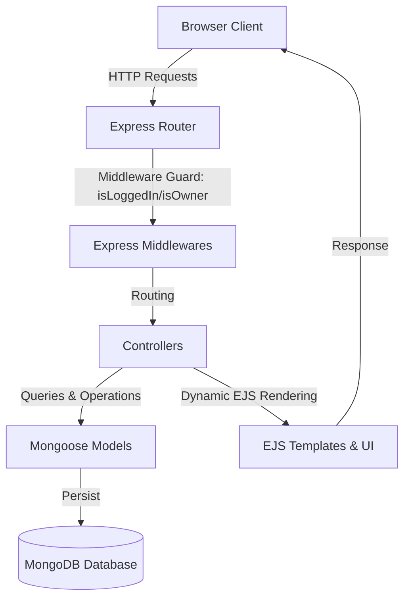

# Wanderlust

A premium, full-stack travel and accommodation marketplace modeled after Airbnb. Wanderlust is built using the **MVC (Model-View-Controller)** pattern, featuring robust user authentication, interactive review systems, secure cloud-based media uploads, and dynamic modern UI/UX design.

Designed to showcase clean code practices, industry-standard authentication pipelines, secure database architectures, and production-grade APIs.

---

## Key Features

- **Secure Authentication & Authorization**: Industry-standard registration, login, and session persistence using `passport` and `passport-local-mongoose`.
- **Complete CRUD Operations**: Users can create, browse, edit, and delete detailed property listings.
- ** Cloud Media Storage**: Integrated with **Cloudinary API** via `multer` for secure, on-the-fly image uploads and automatic WebP format compression.
- ** Interactive Review & Rating Engine**: Clean star-rating system permitting authenticated guests to review properties, with strict owner/author guardrails.
- **Premium UI/UX & Dark Mode Toggle**: Harmonious, modern CSS styling featuring responsive layouts, glassmorphism elements, subtle micro-animations, and a seamless theme switcher.
- **Data Security & Validation**: Robust server-side and client-side schemas enforced via **Joi validation** and Express middleware to prevent bad state submissions.
- **Robust Architecture**:
  - **RESTful Routing**: Structured resource endpoints following standard HTTP protocols.
  - **Centralized Error Handling**: Unified asynchronous error wrapper (`wrapAsync`) and custom `ExpressError` middleware handler.
  - **Modern Code Quality**: Linter rules (ESLint) and code style formatter (Prettier) enforced strictly through Git `husky` pre-commit hooks.

---

## Tech Stack

- **Frontend**: HTML5, Vanilla CSS3 (Custom gradients, animations, CSS variables), EJS (Embedded JavaScript templates), Bootstrap 5, FontAwesome icons
- **Backend**: Node.js, Express.js (REST APIs, Router)
- **Database**: MongoDB (NoSQL), Mongoose ODM
- **Authentication**: Passport.js & Passport Local Strategy
- **Media Hosting**: Cloudinary Storage Cloud API
- **Testing & Quality Assurance**: ESLint, Prettier, Husky, Commitlint

---

## Architecture Overview (MVC)



---

## Getting Started

### Prerequisites
Make sure you have [Node.js](https://nodejs.org/) (v16+) and [MongoDB](https://www.mongodb.com/) installed on your local machine.

### Installation

1. **Clone the Repository**:
   ```bash
   git clone https://github.com/charmyparmar/wanderlust.git
   cd wanderlust
   ```

2. **Install Dependencies**:
   ```bash
   npm install
   ```

3. **Configure Environment Variables**:
   Create a `.env` file in the root directory of the `wanderlust` project:
   ```env
   PORT=3000
   MONGO_URL=mongodb://127.0.0.1:27017/wanderluster
   CLOUD_NAME=your_cloudinary_name
   CLOUD_API_KEY=your_cloudinary_api_key
   CLOUD_API_SECRET=your_cloudinary_api_secret
   ```

4. **Seed the Database**:
   Populate your database with mock listings:
   ```bash
   node init/index.js
   ```

5. **Start the Development Server**:
   ```bash
   npm run dev
   ```

6. Open your browser and navigate to `http://localhost:3000` to run the application.

---

## Code Quality & Workflow Guardrails

This project utilizes pre-commit workflows to ensure a high standard of code safety and format consistency before any code is committed:
- **Husky & Lint-Staged**: Auto-formats scripts, styling sheets, and configurations.
- **ESLint & Prettier**: Enforces semantic consistency and catches unused variables or syntax errors in real-time.
- **Commitlint**: Restricts commits to Conventional Commits standards (e.g. `feat: ...`, `fix: ...`, `chore: ...`).

---
